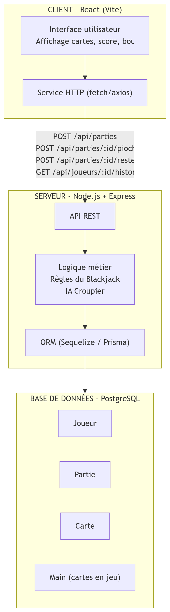
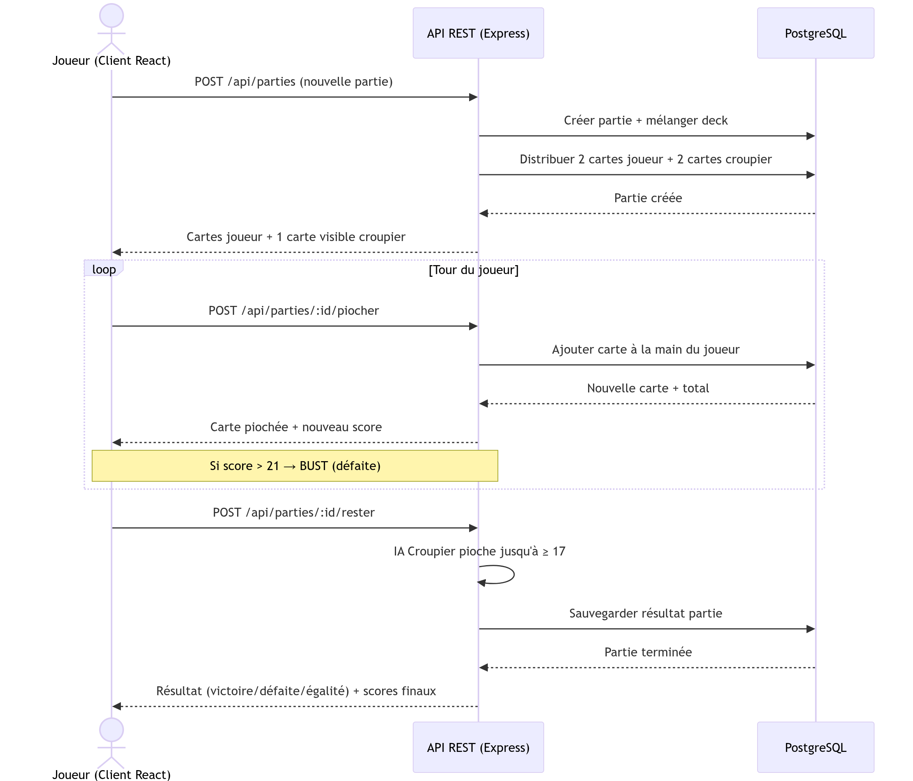

# Blackjack 21

Jeu de Blackjack en ligne — projet de coordination Front-End / Back-End.

## Concept

Le joueur affronte un croupier (IA serveur) au Blackjack. Deux actions possibles : **piocher** ou **rester**. Le but est d'atteindre 21 sans dépasser.

## Stack technique

| Couche | Technologie |
|--------|-------------|
| Front-End | React (Vite) |
| Back-End | Node.js + Express |
| Base de données | PostgreSQL |
| ORM | Sequelize / Prisma |
| Communication | API REST (JSON) |

## Architecture

## Modélisation BDD

### MCD

### MLD

## Livrables

- `activite-1/document_intention.docx` — Document d'intention
- `activite-1/architecture.mermaid` — Schéma d'architecture
- `activite-1/sequence.mermaid` — Diagramme séquentiel
- `activite-2/mcd.mermaid` — Modèle conceptuel de données
- `activite-2/mld.mermaid` — Modèle logique de données
- `activite-2/mld_dbdiagram.dbml` — MLD au format dbdiagram.io